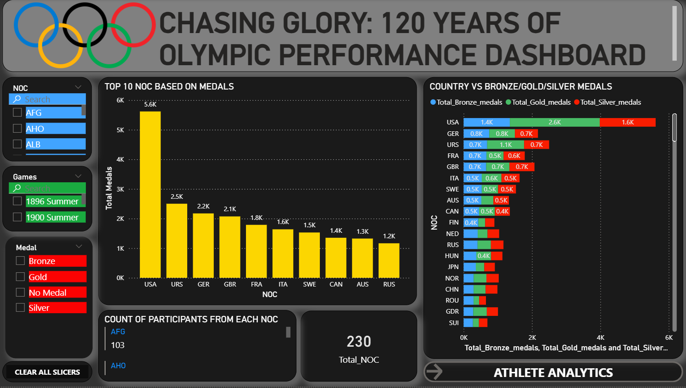

# Excel_PowerBI_MINI_PROJECT
Analyzed 120 years of Olympic Games data (1896–2016) using Excel and Power BI to identify trends in athlete participation, medal distribution, country performance, and age-group achievements. Performed data cleaning, creating interactive dashboards with DAX measures, drill-through analysis, and dynamic visualizations

